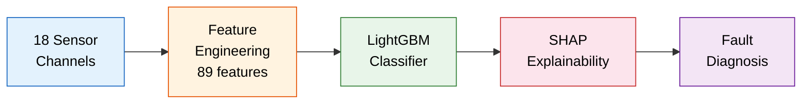
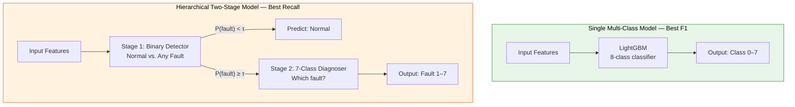
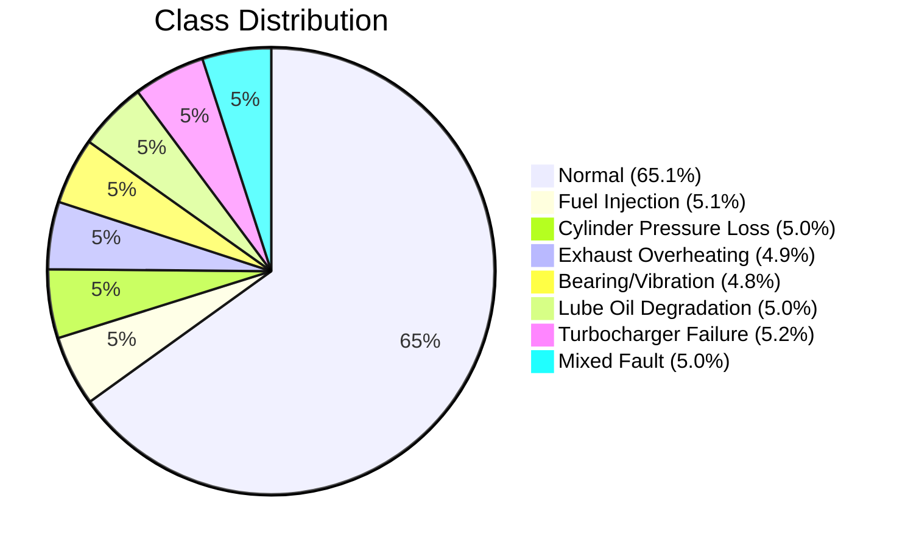
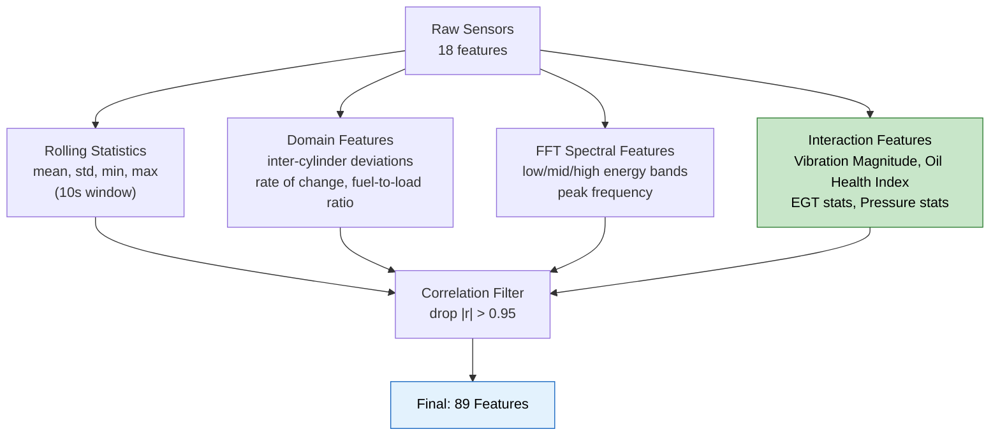
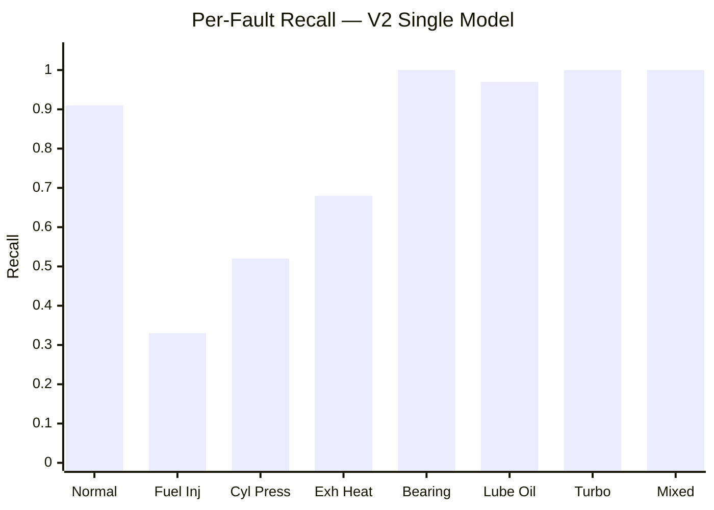
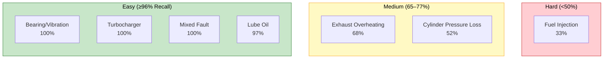
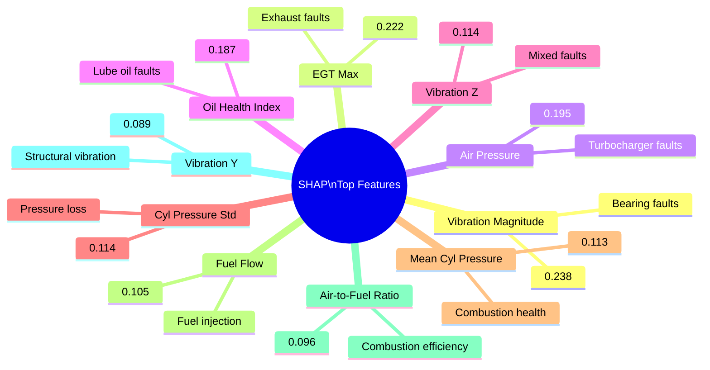

# Marine Engine Predictive Maintenance System

[](https://www.python.org/)
[](https://lightgbm.readthedocs.io/)
[](https://shap.readthedocs.io/)
[](https://jupyter.org/)
[](LICENSE)

An **Explainable Machine Learning** system for predictive maintenance of marine diesel engines, combining **LightGBM** gradient boosting with **SHAP** explainability to detect and diagnose 7 distinct engine fault types from streaming sensor data.

> **Best Model Performance:** Macro F1 = **0.8040** | Macro Recall = **0.8331** | 5 of 7 faults detected at ≥96% recall

---

## Table of Contents

- [Overview](#overview)
- [Architecture](#architecture)
- [Dataset](#dataset)
- [Feature Engineering](#feature-engineering)
- [Models](#models)
- [Results](#results)
- [Explainability](#explainability)
- [Project Structure](#project-structure)
- [Getting Started](#getting-started)
- [License](#license)

---

## Overview

Marine engines are the backbone of maritime transportation — their operational reliability is critical for safety and efficiency. This project builds a fault classification system that ingests 18 sensor channels from a marine diesel engine and classifies each observation into **Normal** operation or one of **7 fault types**.



### Key Design Principles

- **Safety-first:** Optimized for **high recall** — a missed fault (false negative) is far more costly than a false alarm
- **Explainable:** SHAP-based feature attribution provides physically interpretable diagnostic signatures
- **Iterative:** Two development versions (V1 → V2) driven by root-cause analysis of failures

---

## Architecture

Two model architectures were developed and compared:



| Architecture | Macro F1 | Macro Recall | Best For |
|---|---|---|---|
| **V2 Single** | **0.8040** | 0.8331 | Overall balanced performance |
| **V2 Hierarchical** | 0.7302 | **0.8331** | Safety-critical deployments |

---

## Dataset

**10,000** time-stamped sensor observations from a marine diesel engine at 1-second resolution (~2h 47m).



### Sensor Channels (18 features)

| Category | Sensors |
|---|---|
| **Combustion** | Cylinder Pressure (×4) |
| **Exhaust** | Exhaust Gas Temperature (×4) |
| **Vibration** | Vibration X, Y, Z |
| **Lubrication** | Oil Temperature, Oil Pressure |
| **Operational** | Shaft RPM, Engine Load, Torque |
| **Efficiency** | Fuel Flow, Air Pressure |
| **Environment** | Ambient Temperature |

---

## Feature Engineering

The raw 18 sensors are expanded into **89 engineered features** through four pipelines:



### Highlight: V2 Interaction Features

| Feature | Formula | Physical Meaning |
|---|---|---|
| Vibration Magnitude | √(Vx² + Vy² + Vz²) | Total vibration energy |
| Oil Health Index | T_oil / P_oil | Oil degradation proxy |
| EGT Max | max(T₁, T₂, T₃, T₄) | Hottest cylinder exhaust |
| EGT Std | σ(T₁, T₂, T₃, T₄) | Cross-cylinder temperature imbalance |
| Cyl Pressure Std | σ(P₁, P₂, P₃, P₄) | Cross-cylinder pressure imbalance |
| Air-to-Fuel Ratio | P_air / F_flow | Combustion efficiency indicator |
| Fuel per RPM | F_flow / RPM | Specific fuel consumption |

**6 of the top 10 most important features (by SHAP) are V2 interaction features** — validating the engineering decisions.

---

## Results

### Per-Fault Detection Performance (V2 Single Model)



### Fault Detectability Hierarchy



### V1 → V2 Improvement

| Metric | V1 Best | V2 Best | Improvement |
|---|---|---|---|
| **Macro F1** | 0.7302 | **0.8040** | **+10.1%** |
| Normal Recall | 0.5739 | **0.9133** | **+59.1%** |
| Macro Recall | 0.8352 | 0.8331 | −0.25% |

---

## Explainability

SHAP (SHapley Additive exPlanations) provides transparent, physically interpretable explanations for every prediction.

### Top 10 Global Feature Importances



### Diagnostic Signatures

Each fault type has a clear, physics-aligned SHAP signature:

| Fault | Primary SHAP Driver | Physical Explanation |
|---|---|---|
| **Bearing/Vibration** | Vibration X, Y ↑↑ | Degraded bearings cause elevated vibration |
| **Turbocharger** | Air Pressure ↓↓ | Failed turbo can't generate boost pressure |
| **Mixed Fault** | Vibration Z ↑↑ | Compound failure with dominant Z-axis vibration |
| **Lube Oil** | Oil Health Index ↑↑ | High temp + low pressure = degraded lubrication |
| **Exhaust Overheating** | EGT Max, EGT channels ↑ | Elevated exhaust temps across cylinders |
| **Cyl Pressure Loss** | Cyl Pressure Std ↑ | One cylinder loses compression |
| **Fuel Injection** | Fuel Flow ↓ | Disrupted fuel delivery; overlaps with normal variation |

---

## Project Structure

```
├── data/
│   └── marine_engine_fault_dataset.csv   # Raw dataset (10,000 × 20)
├── docs/
│   ├── context.md                        # Project context & planning
│   ├── documentation.md                  # Full technical documentation
│   ├── findings.md                       # Key findings & insights
│   └── report.md                         # Comprehensive project report
├── notebook/
│   └── marine_engine_predictive_maintenance.ipynb  # Main analysis notebook
├── LICENSE
└── README.md
```

---

## Getting Started

### Prerequisites

- Python 3.8+
- Jupyter Notebook / JupyterLab

### Installation

```bash
git clone https://github.com/MrNahadi/New-AIMS.git
cd New-AIMS
pip install lightgbm shap pandas numpy scipy matplotlib seaborn scikit-learn
```

### Run

```bash
jupyter notebook notebook/marine_engine_predictive_maintenance.ipynb
```

---

## License

This project is licensed under the **MIT License** — see the [LICENSE](LICENSE) file for details.

---

<p align="center">
  <i>Built for safer seas through explainable AI</i>
</p>
