# Technical Documentation — Marine Engine Predictive Maintenance System

## Table of Contents

1. [Introduction](#1-introduction)
2. [Technology Stack](#2-technology-stack)
3. [Core Methodology](#3-core-methodology)
4. [Feature Engineering Pipeline](#4-feature-engineering-pipeline)
5. [Modeling Approaches](#5-modeling-approaches)
6. [Single vs. Hierarchical Classification](#6-single-vs-hierarchical-classification)
7. [V1 vs. V2 Architecture Comparison](#7-v1-vs-v2-architecture-comparison)
8. [SHAP Explainability Framework](#8-shap-explainability-framework)
9. [Prediction Smoothing Analysis](#9-prediction-smoothing-analysis)
10. [Technical Glossary](#10-technical-glossary)

---

## 1. Introduction

This document provides a comprehensive technical explanation of the methods, algorithms, and design decisions behind the Marine Engine Predictive Maintenance system. The system ingests streaming sensor data from a marine diesel engine and classifies each observation into one of eight categories: *Normal* operation (label 0) or one of seven distinct fault types (labels 1–7).

The goal is **fault detection with high recall** — in a safety-critical marine environment, a missed fault (false negative) is far more costly than a false alarm (false positive).

---

## 2. Technology Stack

| Component           | Technology                        | Role                                             |
|---------------------|-----------------------------------|-------------------------------------------------|
| Core ML Framework   | LightGBM (Gradient Boosted Trees) | Fast, memory-efficient multi-class classification|
| Feature Engineering | Pandas, NumPy, SciPy (FFT)        | Rolling statistics, spectral features, domain features |
| Explainability      | SHAP (TreeExplainer)               | Model-agnostic feature attribution               |
| Data Splitting      | Manual time-based partition        | Prevents temporal data leakage                   |
| Visualization       | Matplotlib, Seaborn                | EDA, SHAP plots, sensor traces                  |
| Serialization       | Pickle, JSON                       | Model persistence and configuration export       |

### Why LightGBM?

LightGBM was chosen over alternatives for the following technical reasons:

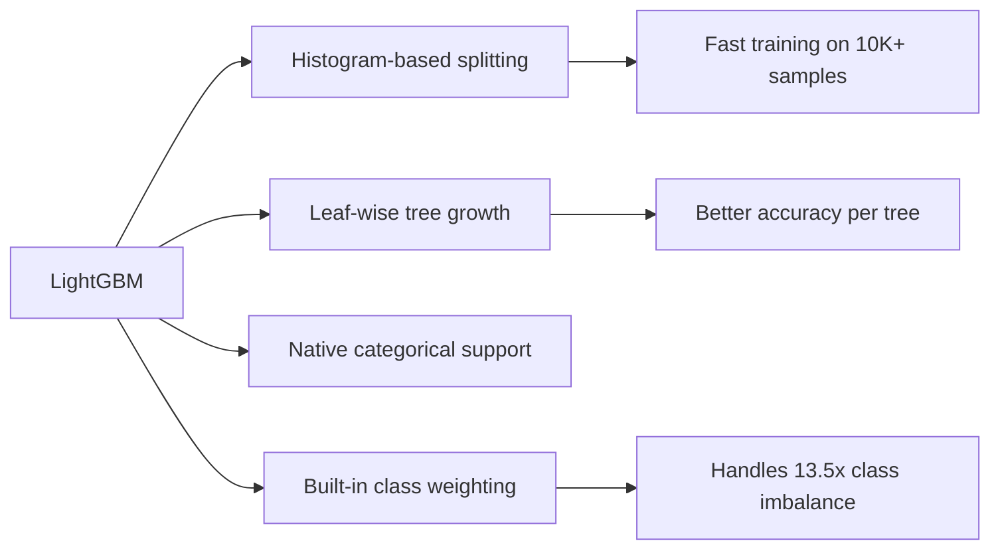

- **Histogram-based splitting** bins continuous features into discrete buckets, reducing the cost of finding optimal splits from $O(n)$ to $O(\text{bins})$.
- **Leaf-wise growth** (vs. level-wise in XGBoost) grows the leaf with the highest loss reduction, producing deeper, more specialized trees.
- **Native class weighting** allows per-class sample weights without manual oversampling (e.g., SMOTE), preserving the original data distribution.

---

## 3. Core Methodology

### 3.1 Problem Formulation

The task is **multi-class classification** over 8 classes with a significant class imbalance:

$$
P(\text{Normal}) \approx 0.65 \quad \text{vs.} \quad P(\text{Fault}_i) \approx 0.05 \quad \forall i \in \{1, \dots, 7\}
$$

The imbalance ratio is:

$$
\text{IR} = \frac{\max_c |C_c|}{\min_c |C_c|} = \frac{6507}{481} \approx 13.5
$$

This ratio is moderate but sufficient to bias an unweighted classifier toward always predicting "Normal," achieving ~65% accuracy while missing all faults.

### 3.2 Class Weighting Strategy

To counteract this, **inverse-frequency class weights** are applied:

$$
w_c = \frac{N}{K \cdot n_c}
$$

Where $N$ is total samples, $K$ is number of classes (8), and $n_c$ is the count for class $c$. This yields:

| Class   | Weight (V1) | Weight (V2, power 1.5) |
|---------|-------------|------------------------|
| Normal  | ~0.19       | ~0.08                  |
| Faults  | ~2.4–2.7    | ~3.9–4.4               |

In V2, weights are raised to the power of 1.5 to more aggressively penalize misclassification of rare fault classes:

$$
w_c^{(\text{V2})} = \left(\frac{N}{K \cdot n_c}\right)^{1.5}
$$

### 3.3 Time-Based Data Splitting

```mermaid
gantt
    title Time-Based Data Split (No Shuffling)
    dateFormat X
    axisFormat %s

    section Dataset
    Training Set (70%)      :done, 0, 6958
    Validation Set (15%)    :active, 6958, 8449
    Test Set (15%)          :crit, 8449, 9940
```

**Why time-based splitting?** In time-series data, random shuffling violates the assumption of temporal independence. A randomly shuffled split can place future observations in the training set and past observations in the test set, allowing the model to "peek" at future states — this is **data leakage**. Time-based splitting ensures the model is always evaluated on data that comes strictly *after* the training data, simulating real-world deployment.

### 3.4 Evaluation Metrics

| Metric       | Formula                                              | Why It Matters                                             |
|--------------|------------------------------------------------------|------------------------------------------------------------|
| Macro Recall | $\frac{1}{K}\sum_{c=1}^{K} \text{Recall}_c$         | Treats all fault types equally, regardless of frequency    |
| Macro F1     | $\frac{1}{K}\sum_{c=1}^{K} F1_c$                    | Balances precision and recall across all classes            |
| Weighted F1  | $\sum_{c=1}^{K} \frac{n_c}{N} \cdot F1_c$           | Reflects overall accuracy weighted by class frequency      |
| Per-class Recall | $\frac{TP_c}{TP_c + FN_c}$                      | Critical for safety — measures how many real faults are caught |

**Primary metric:** Macro Recall ≥ 0.95 for the binary detector; Macro F1 for overall model comparison.

---

## 4. Feature Engineering Pipeline

### 4.1 Pipeline Overview

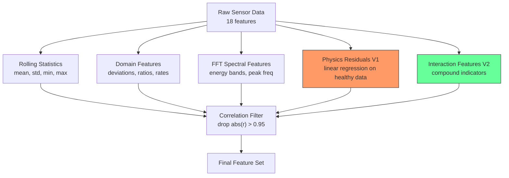

### 4.2 Rolling Statistics

Rolling statistics capture temporal patterns in sensor signals. For a sensor $x$ and a window of size $w$, the rolling statistics are:

| Statistic | Formula | What It Captures |
|-----------|---------|------------------|
| Rolling Mean | $\bar{x}_t = \frac{1}{w}\sum_{i=0}^{w-1} x_{t-i}$ | Baseline operating level |
| Rolling Std | $\sigma_t = \sqrt{\frac{1}{w}\sum_{i=0}^{w-1}(x_{t-i} - \bar{x}_t)^2}$ | Volatility / instability |
| Rolling Min | $\min(x_{t}, x_{t-1}, \ldots, x_{t-w+1})$ | Worst-case dip |
| Rolling Max | $\max(x_{t}, x_{t-1}, \ldots, x_{t-w+1})$ | Peak anomaly magnitude |

**Window sizes:**
- **V1:** 60-second primary window + 10-second secondary window (vibration channels only)
- **V2:** 10-second window only (see [Section 7](#7-v1-vs-v2-architecture-comparison) for rationale)

### 4.3 Domain-Specific Features

These features encode marine engineering knowledge directly into the model:

**Inter-Cylinder Pressure Deviations:**

$$
\Delta P_i = P_{\text{cyl}_i} - \frac{1}{4}\sum_{j=1}^{4} P_{\text{cyl}_j}
$$

A healthy engine has near-equal pressures across cylinders. A deviation in one cylinder indicates pressure loss or misfiring.

**Rate of Change (First Derivative):**

$$
\dot{x}_t = x_t - x_{t-1}
$$

Rapid changes in Oil_Temp or Oil_Pressure can signal sudden degradation.

**Fuel-to-Load Ratio:**

$$
\text{FLR} = \frac{\text{Fuel\_Flow}}{\text{Engine\_Load}}
$$

Normalizes fuel consumption against demanded power. Abnormally high FLR indicates inefficient combustion (fuel not being burned properly in the cylinders).

### 4.4 FFT Spectral Features (Vibration Analysis)

Fast Fourier Transform decomposes vibration signals from the time domain into frequency components:

$$
X_k = \sum_{n=0}^{N-1} x_n \cdot e^{-j 2\pi kn / N}
$$

From the FFT output, three energy bands are extracted:

| Band | Frequency Range | Physical Meaning |
|------|----------------|------------------|
| Low  | 0 – ⅓ bandwidth | Structural resonance, unbalance |
| Mid  | ⅓ – ⅔ bandwidth | Bearing defects, gear mesh |
| High | ⅔ – full bandwidth | Surface defects, cavitation |

Plus the **peak frequency** — the dominant oscillation frequency, which shifts when rotating components degrade.

### 4.5 Physics-Informed Residuals (V1 Only)

**Concept:** Train a linear regression model on healthy data to predict what a sensor *should* read given operational parameters:

$$
\hat{T}_{\text{EGT}} = \beta_0 + \beta_1 \cdot \text{Load} + \beta_2 \cdot \text{RPM} + \beta_3 \cdot T_{\text{ambient}}
$$

The residual $r = T_{\text{actual}} - \hat{T}_{\text{EGT}}$ should be near zero during normal operation and deviate during faults.

**Result:** $R^2 \approx 0.000$ for all models, meaning **no linear relationship exists** between sensor readings and operational parameters in this dataset. The residuals were perfectly correlated ($r = 1.000$) with raw values, adding zero information. These were **removed in V2**.

### 4.6 Interaction Features (V2 Only)

V2 replaced the ineffective physics residuals with engineered interaction features:

| Feature | Formula | Physical Meaning |
|---------|---------|------------------|
| Vibration_Magnitude | $\sqrt{V_x^2 + V_y^2 + V_z^2}$ | Total vibration energy (scalar) |
| Oil_Health_Index | $T_{\text{oil}} / P_{\text{oil}}$ | Oil degradation proxy (high temp + low pressure = bad) |
| EGT_Max | $\max(T_1, T_2, T_3, T_4)$ | Hottest cylinder exhaust |
| EGT_Std | $\sigma(T_1, T_2, T_3, T_4)$ | Cross-cylinder temperature imbalance |
| Cyl_Pressure_Std | $\sigma(P_1, P_2, P_3, P_4)$ | Cross-cylinder pressure imbalance |
| Air_to_Fuel_Ratio | $P_{\text{air}} / F_{\text{flow}}$ | Combustion efficiency indicator |
| Fuel_per_RPM | $F_{\text{flow}} / \text{RPM}$ | Specific fuel consumption |

### 4.7 Correlation Filtering

After all features are generated, a pairwise Pearson correlation matrix is computed. For each pair with $|r| > 0.95$, the feature with lower univariate importance (measured by variance or mean absolute value) is dropped.

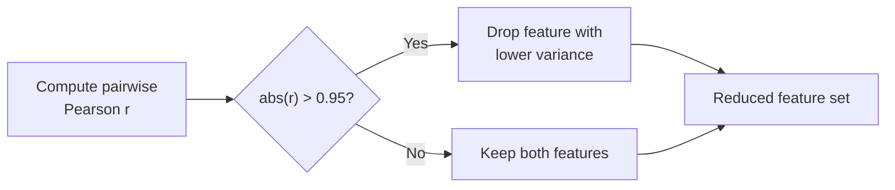

**V1:** Dropped 8 features (126 remaining from 136)
**V2:** Dropped 2 features (89 remaining from 91)

---

## 5. Modeling Approaches

Two modeling architectures were evaluated: **Single Multi-Class** and **Hierarchical (Two-Stage)**.

### 5.1 LightGBM Hyperparameters

| Parameter         | V1 Value     | V2 Value       | Purpose                                |
|-------------------|--------------|----------------|----------------------------------------|
| `num_leaves`      | 63           | 127            | Maximum leaves per tree (model complexity) |
| `learning_rate`   | 0.05         | 0.05           | Step size shrinkage                    |
| `n_estimators`    | 1,000        | 2,000          | Maximum trees before early stopping    |
| `min_child_samples` | 20         | 10             | Minimum samples per leaf               |
| `early_stopping`  | 50 rounds    | 100 rounds     | Patience before stopping               |
| `class_weight`    | Inverse freq | Inverse freq^1.5 | Imbalance correction strength        |

**V2 rationale for changes:**
- **More leaves (127):** Allows deeper, more complex decision boundaries to separate subtle fault signatures.
- **Fewer min_child_samples (10):** Permits the model to create specialized leaves for rare fault patterns.
- **More trees + longer patience (2,000/100):** Gives the model more capacity and time to converge.

---

## 6. Single vs. Hierarchical Classification

### 6.1 Architecture Comparison

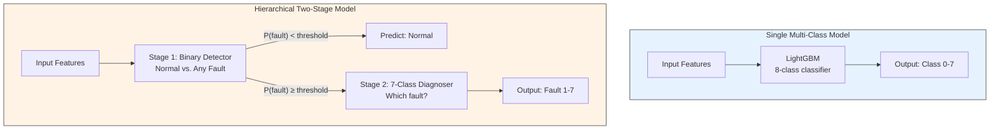

### 6.2 Single Multi-Class Model

**How it works:** A single LightGBM model with `objective='multiclass'` and `num_class=8` learns to distinguish all 8 classes simultaneously. The output is a probability vector of length 8, and the class with the highest probability is selected:

$$
\hat{y} = \arg\max_c \; P(y = c \mid \mathbf{x})
$$

**Strengths:**
- Simpler architecture — one model to train, tune, and maintain
- Higher overall F1 score (better precision-recall balance)
- Very high precision on Normal class (fewer false alarms)

**Weaknesses:**
- Tends to under-predict rare fault classes (biased toward Normal)
- Fuel Injection recall was critically low (0.18 in V1) because the dominant Normal class suppresses minority class predictions

### 6.3 Hierarchical Two-Stage Model

**How it works:**

**Stage 1 — Binary Detector:**
A binary LightGBM classifier asks: *"Is this observation Normal or Faulty?"*

$$
P(\text{fault} \mid \mathbf{x}) = \sigma(f(\mathbf{x}))
$$

where $\sigma$ is the sigmoid function. A **low threshold** (e.g., 0.087) is applied to maximize fault recall:

$$
\hat{y}_{\text{binary}} = \begin{cases} \text{Fault} & \text{if } P(\text{fault}) \geq \tau \\ \text{Normal} & \text{otherwise} \end{cases}
$$

The threshold $\tau$ is tuned to achieve ≥ 95% fault recall on the validation set.

**Stage 2 — Multi-Class Diagnoser:**
Only samples flagged as "Fault" by Stage 1 are passed to a second LightGBM model that classifies among the 7 fault types (labels 1–7). This model is trained exclusively on fault data, so it never needs to distinguish faults from normal operation.

**Strengths:**
- Higher recall on difficult faults (Fuel Injection: 0.18 → 0.60 in V1)
- The low threshold in Stage 1 catches more true faults
- Stage 2 has an easier job (7 classes of similar frequency, no dominant class)

**Weaknesses:**
- Lower precision on Normal class (more false alarms)
- Stage 1 errors cascade — if a Normal sample is incorrectly flagged as Fault, Stage 2 will assign it a specific fault type, creating a confident but wrong diagnosis
- More complex to maintain (two models, a threshold, and pipeline logic)

### 6.4 Comparative Decision Matrix

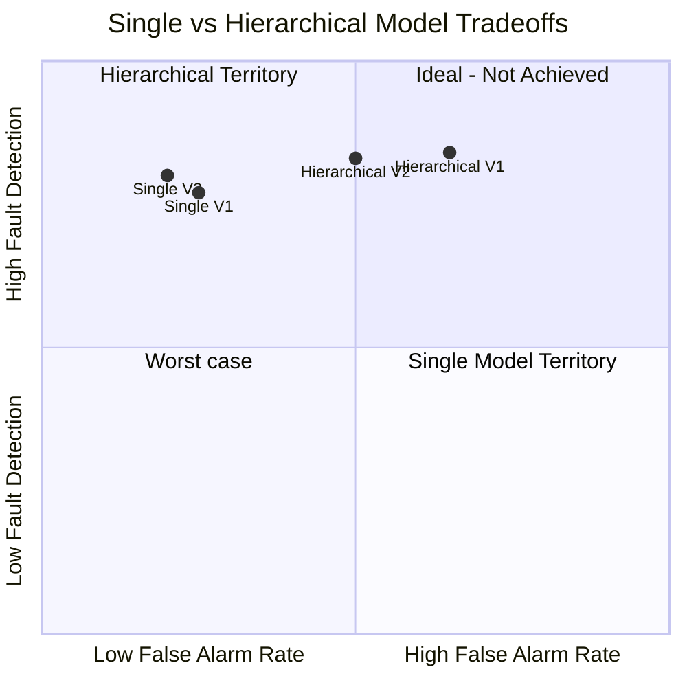

### 6.5 When to Use Which

| Scenario | Recommended Model | Reason |
|----------|-------------------|--------|
| Safety-critical deployment | Hierarchical | Higher fault recall; missing a fault is unacceptable |
| Cost-sensitive (false alarms are expensive) | Single | Higher precision; fewer unnecessary shutdowns |
| Well-separated fault signatures | Single | No need for two-stage separation |
| Subtle/overlapping fault signatures | Hierarchical | Binary detector catches marginal cases |

---

## 7. V1 vs. V2 Architecture Comparison

### 7.1 Fundamental Difference

The V1 → V2 evolution was driven by a critical insight about how faults are represented in the dataset:

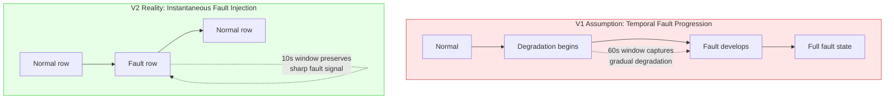

**V1 assumed** that faults develop gradually over time, which motivated long rolling windows (60s) and physics-informed residuals. Both techniques are designed to capture *trends* and *deviations from expected behavior*.

**V2 recognized** that in this dataset, faults are injected per-row (instantaneously), meaning:
- Long windows **dilute** the fault signal with surrounding normal data
- Physics residuals **add no information** because sensor values are independent of operational parameters

### 7.2 Side-by-Side Comparison

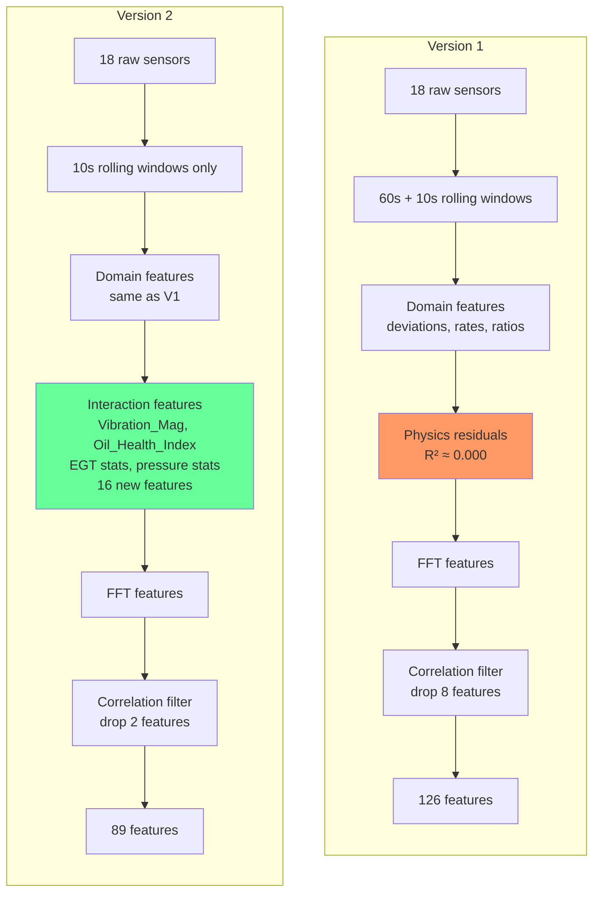

### 7.3 Detailed Change Log

| Aspect | V1 | V2 | Rationale |
|--------|----|----|-----------|
| **Primary window** | 60s | 10s | 60s dilutes per-row faults; 10s retains signal |
| **Secondary window** | 10s (vibration only) | Eliminated (10s is primary) | Unified window simplifies pipeline |
| **Physics residuals** | 5 features (R² ≈ 0.00) | Removed | Zero predictive value; perfectly correlated with raw |
| **Interaction features** | None | 16 features | Capture compound fault signatures |
| **Num leaves** | 63 | 127 | Deeper trees for subtle fault separation |
| **Min child samples** | 20 | 10 | Allow specialized fault leaves |
| **Max trees** | 1,000 | 2,000 | More capacity for complex patterns |
| **Early stopping** | 50 rounds | 100 rounds | Longer patience for convergence |
| **Class weight scaling** | Linear (power 1.0) | Power 1.5 | Stronger emphasis on rare faults |
| **Features count** | 126 | 89 | Fewer but more informative features |
| **Samples retained** | 9,940 (lost 60 to window) | 9,990 (lost 10 to window) | Shorter window wastes fewer samples |
| **Prediction smoothing** | Tested (catastrophic) | Not used | Incompatible with per-row faults |

### 7.4 Performance Impact

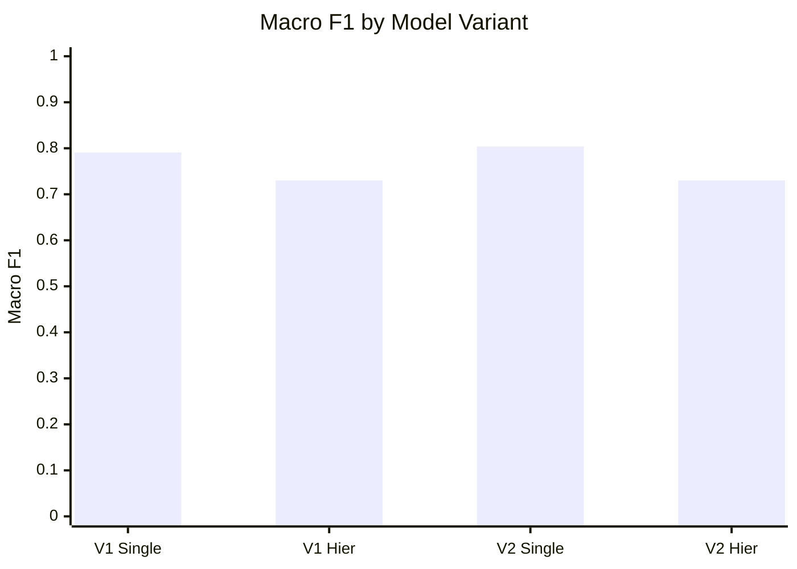

| Metric | V1 Best | V2 Best | Delta |
|--------|---------|---------|-------|
| Macro F1 | 0.7302 (Hier) | 0.8040 (Single) | **+10.1%** |
| Macro Recall | 0.8352 (Hier) | 0.8331 (Hier) | −0.25% |
| Normal Recall | 0.5739 (Hier) | 0.9133 (Single) | **+59.1%** |
| Fuel Injection Recall | 0.6026 (Hier) | 0.4937 (V2 Hier) | −18.1% |

**Key takeaways:**
- V2's overall balance (Macro F1) is substantially better
- V2 Single model achieves the best overall metric (0.8040 F1) while maintaining excellent Normal recall (0.91)
- Fuel Injection remains the hardest fault in both versions — a fundamental dataset limitation

### 7.5 Feature Importance Shift

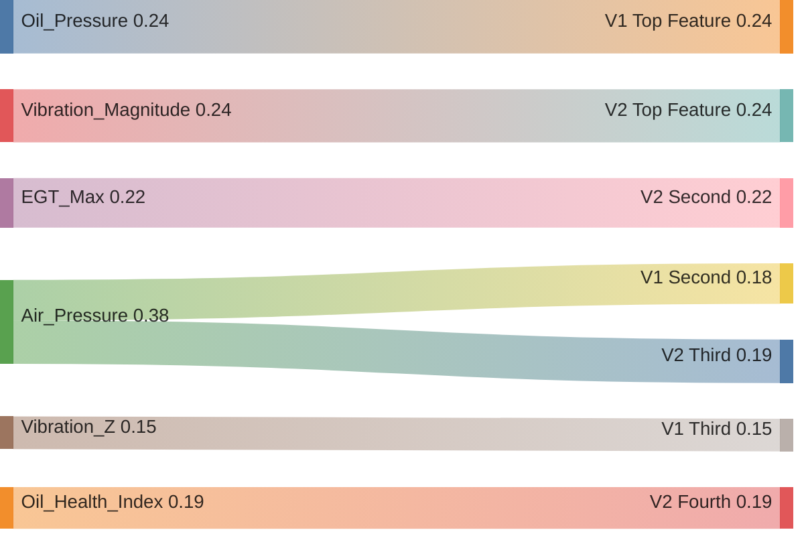

In V1, raw sensor values dominate. In V2, **interaction features** (Vibration_Magnitude, EGT_Max, Oil_Health_Index, Cyl_Pressure_Std) rise to the top, confirming that compound indicators capture fault-relevant information that individual sensors cannot express alone.

---

## 8. SHAP Explainability Framework

### 8.1 What is SHAP?

SHAP (SHapley Additive exPlanations) originates from cooperative game theory. Each feature is treated as a "player" in a coalition game, and the SHAP value represents the marginal contribution of that feature to the prediction:

$$
\phi_i = \sum_{S \subseteq F \setminus \{i\}} \frac{|S|! \; (|F| - |S| - 1)!}{|F|!} \left[ f(S \cup \{i\}) - f(S) \right]
$$

Where:
- $\phi_i$ = SHAP value for feature $i$
- $F$ = set of all features
- $S$ = subset of features excluding $i$
- $f(S)$ = model prediction using only features in $S$

For tree-based models, `TreeExplainer` computes exact SHAP values in polynomial time (rather than the exponential brute-force approach), making it practical for 89–126 features.

### 8.2 SHAP in Multi-Class Context

For an 8-class problem, SHAP produces an $N \times F \times K$ tensor:
- $N$ = number of samples
- $F$ = number of features
- $K$ = number of classes (8)

Each entry $\phi_{n,f,k}$ represents: *"How much does feature $f$ push sample $n$'s prediction toward class $k$?"*

**Global importance** is computed by averaging absolute SHAP values:

$$
\text{Importance}(f) = \frac{1}{N \cdot K} \sum_{n=1}^{N} \sum_{k=1}^{K} |\phi_{n,f,k}|
$$

### 8.3 Per-Fault Diagnostic Signatures

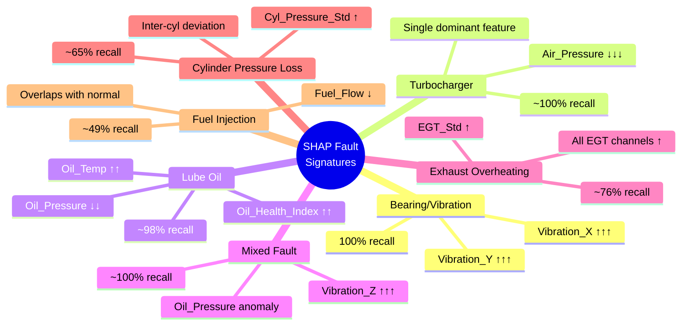

The SHAP analysis reveals a clear hierarchy of fault detectability that maps directly to the physics:
- **Easy faults:** Have a single, strong discriminating feature (vibration for bearings, air pressure for turbocharger)
- **Medium faults:** Require multiple features in combination (oil temp + oil pressure for lube oil)
- **Hard faults:** Have subtle signatures that overlap with normal operational variation (fuel flow for fuel injection)

---

## 9. Prediction Smoothing Analysis

### 9.1 Techniques Tested

**Majority Vote (k=5):** Replace each prediction with the mode of the surrounding 5 predictions:

$$
\hat{y}_t^{\text{smooth}} = \text{mode}(\hat{y}_{t-2}, \hat{y}_{t-1}, \hat{y}_t, \hat{y}_{t+1}, \hat{y}_{t+2})
$$

**Persistence Filter:** Only change the prediction if the new class persists for ≥3 consecutive timesteps:

$$
\hat{y}_t^{\text{persist}} = \begin{cases} c & \text{if } \hat{y}_{t} = \hat{y}_{t+1} = \hat{y}_{t+2} = c \\ \hat{y}_{t-1}^{\text{persist}} & \text{otherwise} \end{cases}
$$

### 9.2 Why Smoothing Failed

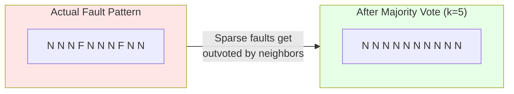

Faults in this dataset are isolated single-row events. In a 5-element window, a fault is outnumbered 4:1 by normal rows and is eliminated by majority voting. Similarly, persistence filtering requires 3+ consecutive fault predictions, which almost never occurs.

**Key insight:** Smoothing techniques assume **temporal clustering** of events. They are designed for scenarios like "*the engine ran in a degraded state for 30 seconds*." When faults are instantaneous blips, smoothing is counterproductive.

---

## 10. Technical Glossary

| Term | Definition |
|------|-----------|
| **EGT** | Exhaust Gas Temperature — temperature of combustion products leaving the cylinder |
| **FFT** | Fast Fourier Transform — algorithm to decompose a time-domain signal into frequency components |
| **LightGBM** | Light Gradient Boosted Machine — Microsoft's gradient boosting framework |
| **Macro F1** | Unweighted average of per-class F1 scores |
| **SHAP** | SHapley Additive exPlanations — game-theoretic feature attribution method |
| **R²** | Coefficient of determination — proportion of variance explained by a regression model |
| **Rolling window** | A sliding window that computes statistics over the last $w$ observations |
| **Data leakage** | When information from outside the training set is used to create the model |
| **Early stopping** | Halting training when validation loss stops improving, preventing overfitting |
| **Class imbalance** | When one or more classes have significantly more samples than others |
| **Threshold tuning** | Adjusting the decision boundary probability to favor recall over precision |
| **Residual** | Difference between actual and predicted value from a regression model |
| **Pearson correlation** | Linear correlation coefficient ranging from −1 to +1 |
| **TreeExplainer** | SHAP's efficient algorithm for computing exact SHAP values on tree models |
