# Project Report — Marine Engine Predictive Maintenance

**Project Duration:** Data analysis and modeling lifecycle  
**Dataset:** 10,000 sensor observations from a marine diesel engine  
**Objective:** Build a fault classification system that detects and diagnoses 7 engine fault types with high recall  
**Final Result:** Macro F1 = 0.8040, Macro Recall = 0.8331

---

## 1. Executive Summary

This report traces the complete journey from raw sensor data to a deployed-ready predictive maintenance model for marine diesel engines. The project proceeded through four major phases: exploratory data analysis, feature engineering, model development (two versions), and explainability analysis. Two competing architectures — a single multi-class classifier and a hierarchical two-stage detector — were evaluated across two feature engineering iterations (V1 and V2), resulting in four distinct model variants.

The best overall model (V2 Single, Macro F1 = 0.8040) reliably detects 5 of 7 fault types with ≥96% recall. Two thermodynamic fault types (Fuel Injection and Cylinder Pressure Loss) remain challenging due to their subtle sensor signatures, representing a fundamental limitation of the available sensor instrumentation rather than a modeling deficiency.

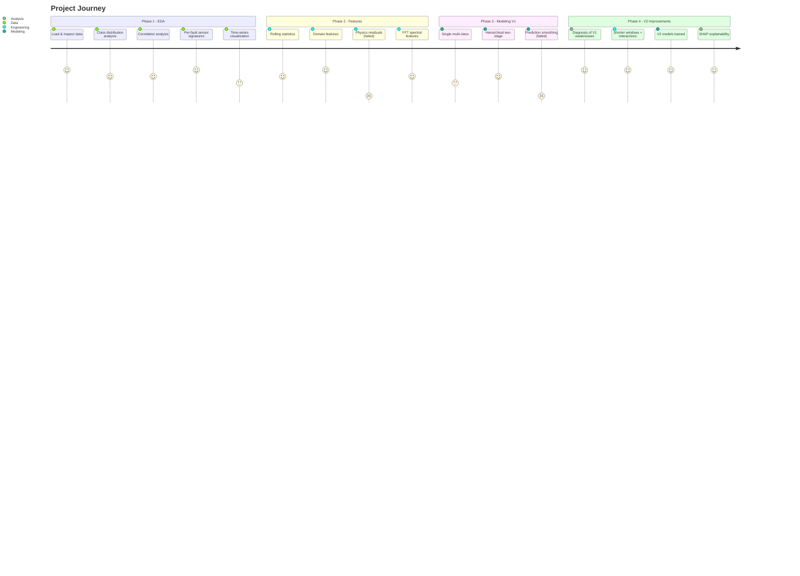

---

## 2. Phase 1 — Exploratory Data Analysis

### 2.1 What We Started With

The dataset contains 10,000 time-stamped sensor readings from a marine diesel engine, sampled at 1-second resolution over approximately 2 hours and 47 minutes. Each row represents a snapshot of 18 sensor channels plus a fault label.

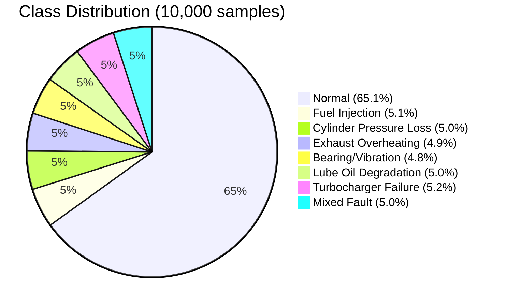

**First key finding:** The dataset has a 13.5× class imbalance. Normal operation dominates at 65%, with each fault type comprising only ~5%. Without correction, a naive classifier would learn to predict "Normal" for everything and achieve 65% accuracy while detecting zero faults.

### 2.2 Correlation Discovery

We computed the full 18×18 sensor correlation matrix and found:

- **No dangerously correlated pairs** (|r| > 0.95) among raw sensors — good news, as highly correlated features waste model capacity
- **Vibration_X ↔ Vibration_Y** (r = 0.88) — expected physical coupling across vibration axes
- **Oil_Temp ↔ Oil_Pressure** (r = −0.28) — weak negative, consistent with viscosity physics
- **Vibration_Z ↔ Oil_Pressure** (r = −0.49) — moderate, suggesting vibration mechanically affects oil pressure readings

**Conclusion:** Raw features are largely independent, which is favorable for tree-based models. No feature removal was needed at this stage.

### 2.3 Per-Fault Sensor Behavior

Boxplot analysis across fault types revealed a spectrum of detectability:

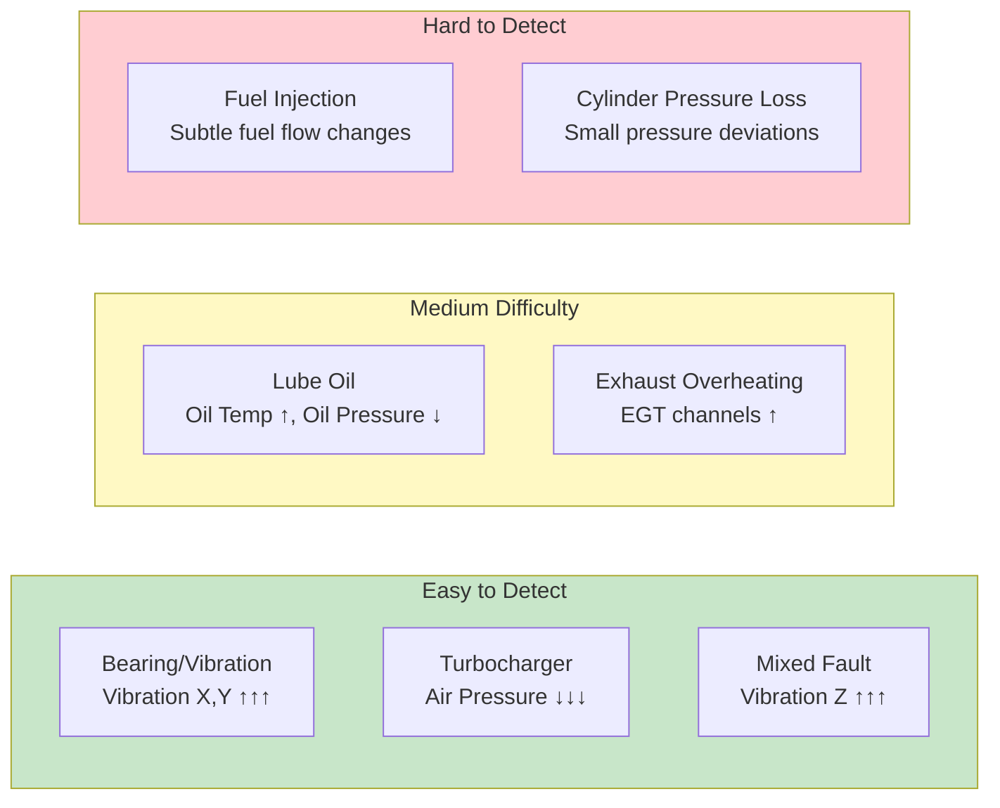

### 2.4 Temporal Pattern Discovery

Time-series visualization of sensor traces revealed a critical characteristic of this dataset: **faults appear as instantaneous, single-row events** scattered randomly across time, not as sustained degradation episodes. Sensor values jump abruptly at fault boundaries rather than drifting gradually.

We confirmed this by analyzing 463 transitions into Exhaust Overheating (Label 3) — there was **no pre-onset EGT drift**. The fault label simply switches from 0 to 3 and back without any thermal ramp-up.

**Impact on strategy:** This finding fundamentally shaped our approach. Traditional time-series techniques designed for gradual degradation (long rolling windows, drift detection) would be less effective. The model needs to detect per-row anomalies.

### 2.5 Window Size Selection

Autocorrelation analysis of key sensors (Vibration_X, Cylinder1_Exhaust_Temp, Oil_Temp) showed autocorrelation dropping to ~0 within 30–60 lags. We selected:
- **Primary window:** 60 seconds (V1) / 10 seconds (V2)
- **Secondary window:** 10 seconds for vibration channels (V1 only)

---

## 3. Phase 2 — Feature Engineering

### 3.1 Strategy

We pursued four categories of engineered features, each targeting a different aspect of fault behavior:

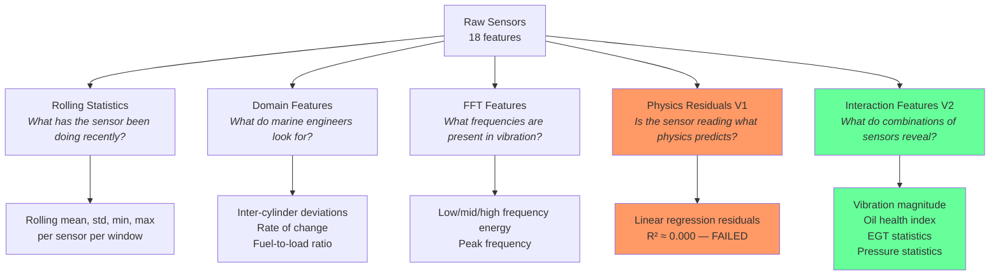

### 3.2 What Worked

- **Rolling statistics** provided temporal context — rolling std captured instability, rolling max captured peak anomaly values
- **Inter-cylinder deviations** isolated single-cylinder faults by comparing each cylinder against the group average
- **FFT vibration features** decomposed vibration signals into frequency bands relevant to specific mechanical defects
- **Interaction features (V2)** — Oil_Health_Index, Vibration_Magnitude, EGT_Std, and Cyl_Pressure_Std became top SHAP features, confirming their value

### 3.3 What Failed

**Physics-informed residuals (V1):** We trained linear regression models on healthy data to predict expected EGT and Oil_Temp from Engine_Load, Shaft_RPM, and Ambient_Temp. Every model achieved $R^2 \approx 0.000$ — the sensors have no linear relationship with operational parameters in this dataset. The resulting residuals were perfectly correlated ($r = 1.000$) with raw sensor values, adding zero information. All 5 residual features were caught and removed by the correlation filter.

**Lesson learned:** Physics-informed features require that the underlying data actually contains the expected physical relationships. In simulated datasets, these relationships may not be modeled.

### 3.4 Correlation Filtering Results

| Version | Features Before Filter | Pairs Dropped | Features After Filter |
|---------|----------------------|---------------|-----------------------|
| V1      | 136                  | 8             | 126                   |
| V2      | 91                   | 2             | 89                    |

V2's cleaner feature set (fewer redundancies) reflects the removal of physics residuals and the more targeted nature of interaction features.

---

## 4. Phase 3 — Model Development (V1)

### 4.1 Architecture Decisions

We trained two competing architectures:

1. **Single Multi-Class Model** — one LightGBM classifier for all 8 classes
2. **Hierarchical Two-Stage Model** — a binary Normal-vs-Fault detector followed by a 7-class fault diagnoser

Both used class-weighted training to counteract the 13.5× imbalance.

### 4.2 V1 Results

```mermaid
xychart-beta
    title "V1 Per-Class Recall Comparison"
    x-axis ["Normal", "Fuel Inj", "Cyl Press", "Exh Heat", "Bearing", "Lube Oil", "Turbo", "Mixed"]
    y-axis "Recall" 0 --> 1
    bar [0.9447, 0.1795, 0.4691, 0.6184, 1.0, 0.9778, 0.9733, 1.0]
    bar [0.5739, 0.6026, 0.7531, 0.7632, 1.0, 0.9889, 1.0, 1.0]
```

*(First bar = Single model, Second bar = Hierarchical model)*

**Critical observations:**

| Finding | Detail |
|---------|--------|
| Bearing, Lube Oil, Turbo, Mixed | Near-perfect recall in both models (≥97%) |
| Fuel Injection (Single) | 82% of faults missed — critically unsafe |
| Fuel Injection (Hierarchical) | Improved to 60% — still concerning |
| Normal (Hierarchical) | Only 57% — unacceptably high false alarm rate |
| Overall winner (F1) | Single model (0.7909 vs 0.7302) |
| Overall winner (Recall) | Hierarchical model (0.8352 vs 0.7704) |

### 4.3 Prediction Smoothing Attempt

We tested two temporal smoothing techniques to reduce prediction noise:

| Method | Macro F1 | Macro Recall |
|--------|----------|--------------|
| Raw predictions | 0.7302 | 0.8352 |
| Majority Vote (k=5) | 0.2278 | 0.2157 |
| Persistence Filter | 0.0967 | 0.1250 |

**Both techniques catastrophically degraded performance.** Majority voting reduced F1 by 69%; persistence filtering by 87%. The root cause: these techniques assume faults occur in sustained clusters, but our faults are isolated single-row events that get "outvoted" by surrounding normal predictions.

**Decision:** Prediction smoothing abandoned. Not applicable to this dataset's fault injection pattern.

---

## 5. Phase 4 — V2 Improvements

### 5.1 Diagnosis of V1 Weaknesses

Before building V2, we identified three root causes of V1's limitations:

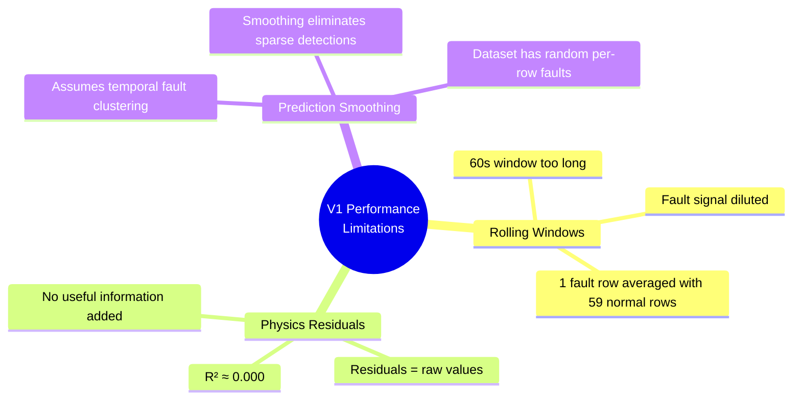

### 5.2 V2 Changes Applied

Based on the diagnosis, we made the following changes:

| Change | Before (V1) | After (V2) | Expected Impact |
|--------|-------------|------------|-----------------|
| Rolling window | 60s | 10s | Less dilution of fault signals |
| Physics residuals | 5 features (R² ≈ 0) | Removed | Eliminate noise |
| Interaction features | None | 16 new features | Capture compound fault signatures |
| Class weight power | 1.0 (linear) | 1.5 (superlinear) | Stronger minority class emphasis |
| Tree complexity | 63 leaves | 127 leaves | Better separation of subtle faults |
| Min child samples | 20 | 10 | Allow rare fault specialization |
| Max iterations | 1,000 | 2,000 | More capacity |
| Early stopping patience | 50 | 100 | Longer convergence window |
| Prediction smoothing | Tested | Not used | Avoid destructive filtering |

### 5.3 V2 Results

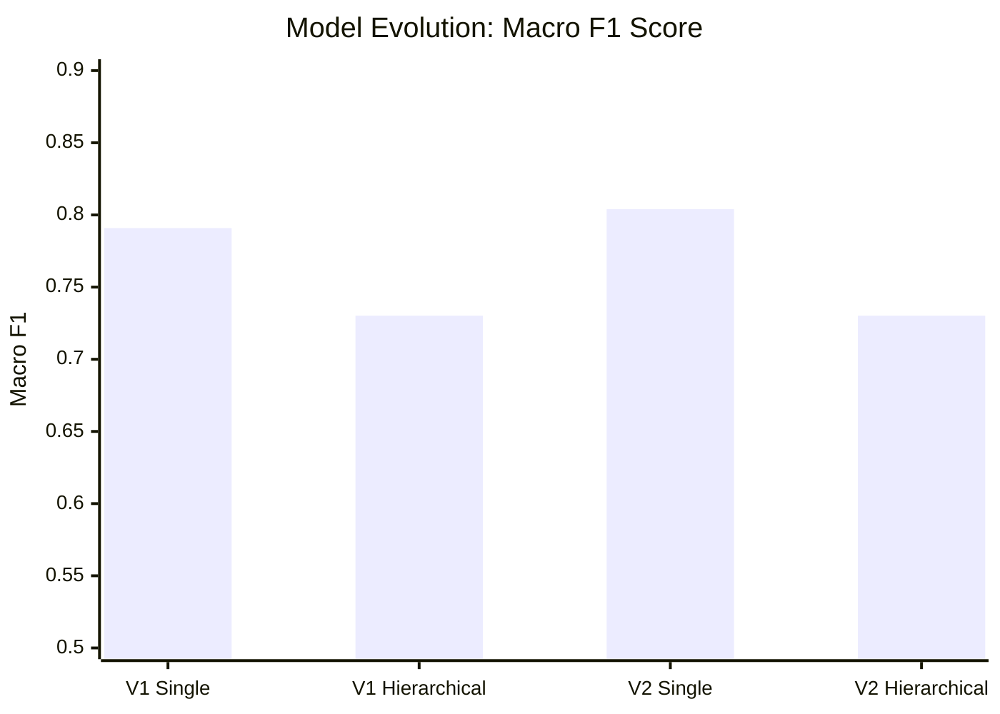

**V2 Single model achieved the best overall performance:**

| Metric | V1 Best | V2 Best | Improvement |
|--------|---------|---------|-------------|
| **Macro F1** | 0.7302 | **0.8040** | **+10.1%** |
| Macro Recall | 0.8352 | 0.8331 | −0.25% |
| Normal Recall | 0.5739 | 0.9133 | +59.1% |

The V2 Single model simultaneously improved fault detection F1 and dramatically reduced the false alarm rate (Normal recall: 0.57 → 0.91).

### 5.4 Per-Fault Evolution Across All Four Models

```mermaid
xychart-beta
    title "Recall by Fault Type Across Model Versions"
    x-axis ["Normal", "Fuel Inj", "Cyl Press", "Exh Heat", "Bearing", "Lube Oil", "Turbo", "Mixed"]
    y-axis "Recall" 0 --> 1
    bar [0.9447, 0.1795, 0.4691, 0.6184, 1.0, 0.9778, 0.9733, 1.0]
    bar [0.5739, 0.6026, 0.7531, 0.7632, 1.0, 0.9889, 1.0, 1.0]
    bar [0.9133, 0.3291, 0.5185, 0.6842, 1.0, 0.9670, 1.0, 1.0]
    bar [0.7770, 0.4937, 0.6543, 0.7763, 1.0, 0.9890, 0.9868, 0.9873]
```

*(Bars: V1 Single, V1 Hierarchical, V2 Single, V2 Hierarchical)*

---

## 6. Explainability Analysis (SHAP)

### 6.1 What We Learned

SHAP analysis on the hierarchical model revealed which features drive each fault prediction:

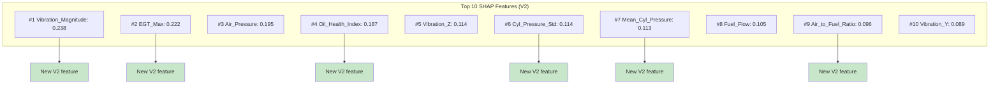

**6 of the top 10 features are new V2 interaction features** — validating the feature engineering decisions.

### 6.2 Fault Diagnostic Mapping

SHAP revealed clear, physically interpretable diagnostic signatures for each fault type:

| Fault | Primary SHAP Driver | Physical Explanation | Recall |
|-------|---------------------|---------------------|--------|
| Bearing/Vibration | Vibration_X, Vibration_Y ↑↑ | Degraded bearings cause elevated multi-axis vibration | 100% |
| Turbocharger | Air_Pressure ↓↓ | Failed turbocharger cannot generate boost pressure | ~100% |
| Mixed Fault | Vibration_Z ↑↑ | Compound failure with dominant Z-axis vibration | ~100% |
| Lube Oil | Oil_Health_Index ↑↑ | High temp + low pressure = degraded lubrication | ~98% |
| Exhaust Overheating | EGT_Max, EGT channels ↑ | Elevated exhaust temperatures across cylinders | ~77% |
| Cylinder Pressure Loss | Cyl_Pressure_Std ↑ | One cylinder loses compression; others remain normal | ~65% |
| Fuel Injection | Fuel_Flow ↓ | Disrupted fuel delivery; overlaps with normal variation | ~49% |

---

## 7. Final Model Selection & Artifacts

### 7.1 Selected Model

**V2 Single Multi-Class Model** — selected for best overall Macro F1 (0.8040) with acceptable recall (0.83) and excellent Normal precision (low false alarm rate).

For deployments where fault recall is paramount over false alarm rate, the **V2 Hierarchical Model** remains available.

### 7.2 Exported Artifacts

| Artifact | File | Size | Purpose |
|----------|------|------|---------|
| Single model | `marine_engine_full_model.pkl` | 4.93 MB | Primary deployed model |
| Binary detector | `marine_engine_detector.pkl` | 0.76 MB | Stage 1 of hierarchical pipeline |
| Fault diagnoser | `marine_engine_diagnoser.pkl` | 4.53 MB | Stage 2 of hierarchical pipeline |
| Pipeline config | JSON file | — | Window sizes, feature lists, dropped features |
| SHAP importance | CSV file | — | Feature importance rankings |

### 7.3 Overall Process Flow

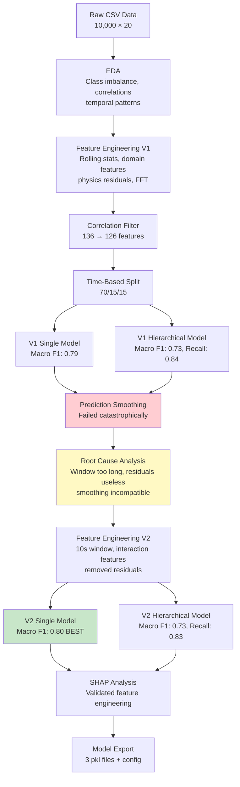

---

## 8. Remaining Challenges & Recommendations

### 8.1 Unresolved Fault Detection Gaps

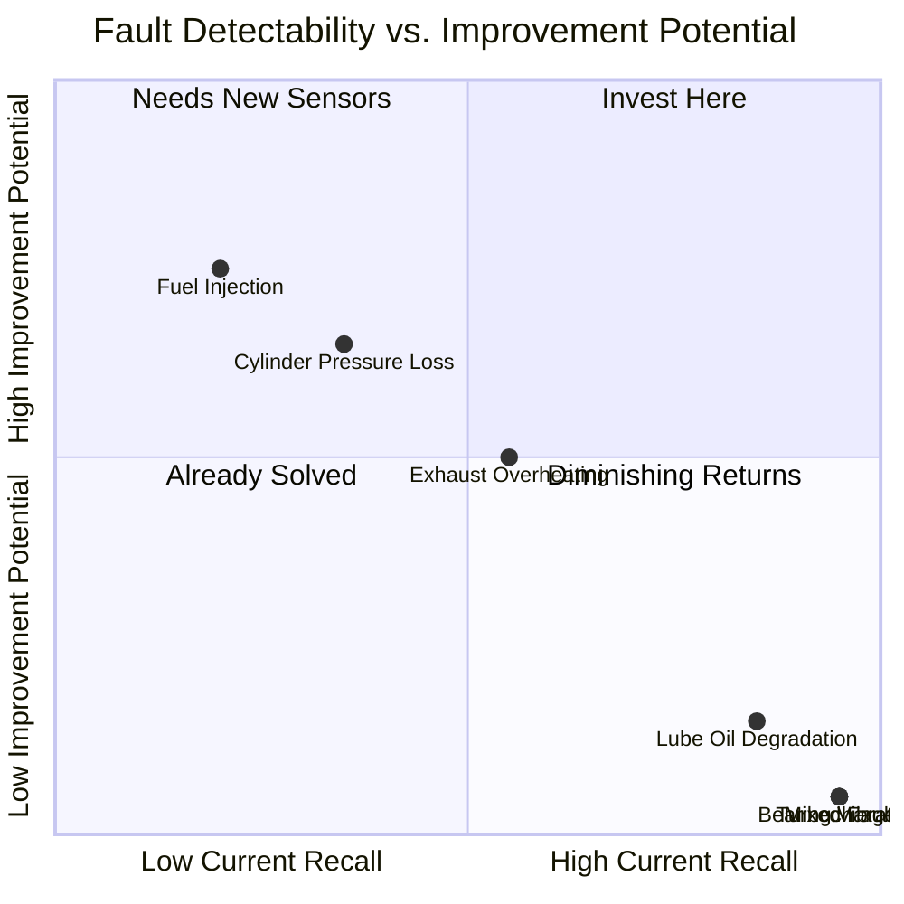

### 8.2 Recommendations

| Priority | Recommendation | Expected Impact |
|----------|---------------|-----------------|
| **High** | Collect more diverse Fuel Injection fault examples | Improve the weakest fault class from ~49% recall |
| **High** | Add injector-specific sensors (fuel pressure pulsation) | Provide discriminative signal that current sensors lack |
| **Medium** | Re-evaluate physics residuals on real-world data | Real engines have true sensor-operational parameter relationships |
| **Medium** | Test temporal smoothing on real-world data | Real faults persist over time, making smoothing effective |
| **Low** | Establish retraining schedule for production | Model drift as engine ages |
| **Low** | Explore neural network architectures (CNN, LSTM) | May capture patterns tree models miss |

### 8.3 Key Lessons Learned

1. **Domain knowledge matters more than model complexity.** The V2 interaction features (Vibration_Magnitude, Oil_Health_Index, EGT_Std) provided more improvement than doubling tree count or hyperparameter tuning.

2. **Validate assumptions about the data.** V1's physics residuals and temporal smoothing were both sound techniques rendered useless by the specific characteristics of this dataset (no physics relationships, no temporal fault clustering).

3. **Simpler is often better.** V2 used 89 features (vs. 126) and the simpler single-model architecture outperformed the more complex hierarchical approach on the primary metric.

4. **Not all faults are equally detectable.** There is a fundamental hierarchy driven by signal-to-noise ratio. No amount of modeling sophistication will overcome a lack of discriminative signal in the sensor data itself.

---

*Report generated from analysis of marine_engine_fault_dataset.csv with LightGBM-based multi-class classification pipeline.*
